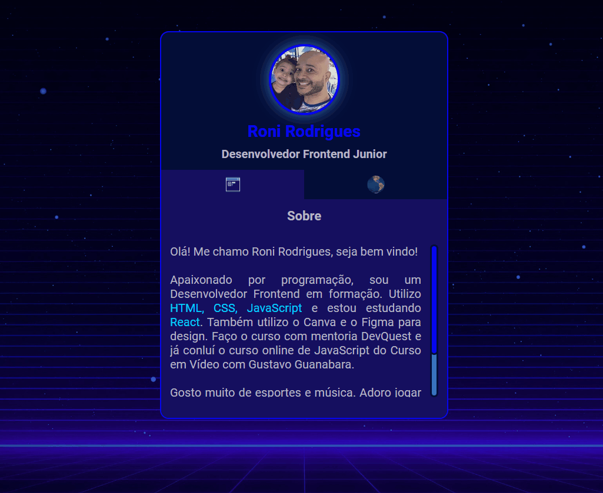

# Projeto Mini Portifólio 💻🌎

Projeto realizado com o intuito de destacar minhas habilidades como programador. Aba um: sobre, aba dois: redes.

## Tecnologias usadas

- HTML
- CSS
- JavaScript

Clique na imagem para acessar o projeto!
